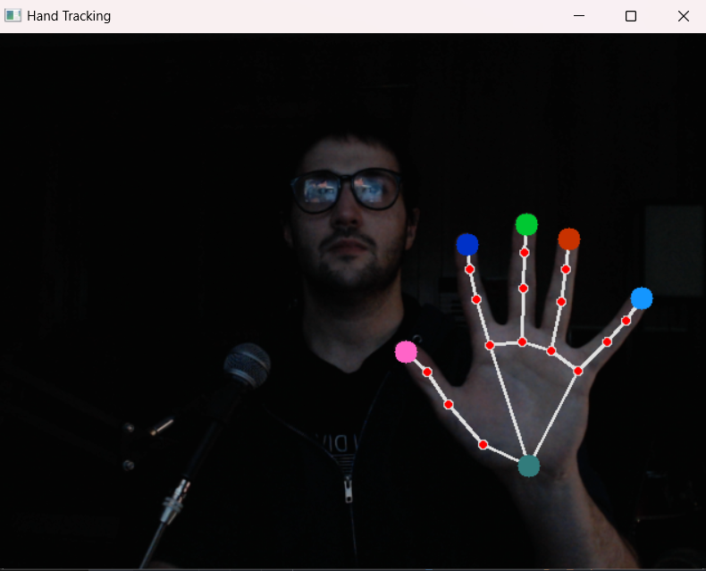
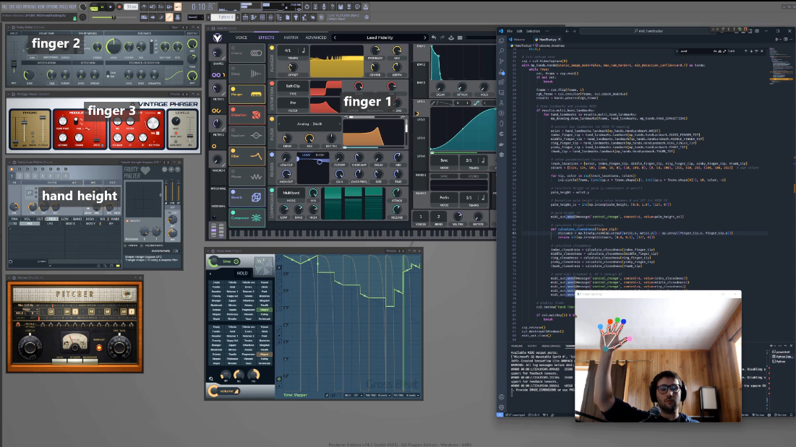

# Hand Track to MIDI

This project is a hand tracking system that uses a webcam to track the user's hand and convert the hand movements into MIDI signals. The system is built using Python and OpenCV for hand tracking through Google's `mediapipe` library and the `mido` library for MIDI signal generation.

See here for the result: https://youtu.be/Xb88uwkwUaE

## Getting it working

1) be sure a camera is attached to the computer (no manual assignment was necessary for me)

2) download loopMIDI and create a virtual port (I named mine "PythonMIDI")

3) open the script with a text editor and add the name of the port from step 2 to the code as seen here:

   `midi_out = mido.open_output('PythonMIDI')`

4) run the script with `python hand_track_to_midi.py` and, after a few seconds, the video feed window should open automatically

5) put a hand into frame and confirm that tracking is working (you will know...see Figure 1 below)

6) find and enable the MIDI port you created from your audio software of choice (FL Studio was used in the video)

7) connect the MIDI CC from the script (channel 1, CC 1-6) to your desired parameters (e.g., filter cutoff, wet/dry mix, etc.)

8) press 'q' to quit the program (exiting the window will not stop the script)

### Figure 1: Hand Tracking Example

### Figure 2: MIDI CC Example Use (from [video](https://youtu.be/Xb88uwkwUaE))

## Requirements

- [Python 3.12](https://www.python.org/downloads/release/python-3120/)

- [loopMIDI](https://www.tobias-erichsen.de/software/loopmidi.html) virtual MIDI cable by Tobias Erichsen

- MIDI capable software (FL Studio, [Vital](https://vital.audio/), etc.)

## Tips and Pitfalls

The system is free and relatively easy to create and use, but here are a few difficulties that may arise:

- **Python Version Pitfall:** Mediapipe would not even install for me with Python 3.13 (current version as of writing).  I recommend a virtual environment with 3.12 if your installation fails

- **LoopMIDI Port Naming Bug:** You will have to name your port in loopMIDI and use that same name in the code.  HOWEVER, for me, the port was created slightly different from how I typed it ("PythonMIDI 3" instead of "PythonMIDI").  I included a print statement to show the available ports, so be sure to check the terminal if the script fails before video capture initiates

- **Linking Tip:** I found it easiest use the `Multilink to Controllers` button in FL studio (or using hotkey `ctrl + j`) and tweaking a parameter's dial/fader while my hand was on-screen.  Of course, several signals are being sent at once, so just be sure to manually change the CC number at the top of the MIDI Learn pop-up prompt to the desired finger.

- **Smoothing Tip:** I found unsmoothed data to be acceptable in some contexts, but never preferable.  The script can be modified to include smoothing, but FL has a native smoothing function (found in the aforementioned pop-up prompt) with a customizable time window that I found to be sufficient at around 15 ms.  Even with this additional delay, the latency to be noticeable, but far from prohibitive for CC control (Though I would not recommend this for playing notes)

- **Mapping Tip:** the CC value maps can be tailored to the desired sensitivity and range of the parameter you are controlling (e.g., a filter cutoff may sound good only across 70-100 but you may want delicate control and thus a to control movement across those values with a large, deliberate motion).  However, I found that the input mapping field (in the same prompt as mentioned above) allowed for a more intuitive and immediate mapping of the CC values to the desired parameter.  I frequently used something like `Input + 0.5`, which is automatically clamped to valid CC values (represented in the window as 0-1) and represented with a plot that updates when you press `enter`

## Future Work

I don't anticipate building on this much.  It's basically mediapipe and mido working as they were intended out of the box, not terribly creative on my part.  There are some potential improvements that have occurred to me, though.

One space with ample room for improvement in the way gestures are recognized. "Finger closedness" is calculated based on fingertip-to-wrist distance which is both vulnerable to the hand's forward angle with the camera and requires mapping to bridge the lingering gap for a fully folded finger.  A different node association could be used, but that would still not be robust to angling (though I imagine in some hands, wrist angle may feel natural as another dimension of control)

Recognizable gestures (e.g., peace, rock on, ok) and speed-based control (e.g., wrist flick) are also within reason.  Though I couldn't be bothered to investigate, I imagine mediapipe or another library has a gesture recognition model that could be employed rather than working from scratch.

Finally, the MIDI output could be expanded to include note-on and note-off messages.  Certainly any percussive or transient-heavy triggered audio would suffer from the latency of this method, but I can imagine something like using one hand for effects as shown so far while the other triggers notes which go through FL's Patcher and Key Mapper to generate multi-instrument chords, arpeggios, bass, etc. (as demonstrated [here](https://youtu.be/1eidT2TAIt8) for my FRK AutoChords Patcher preset)
