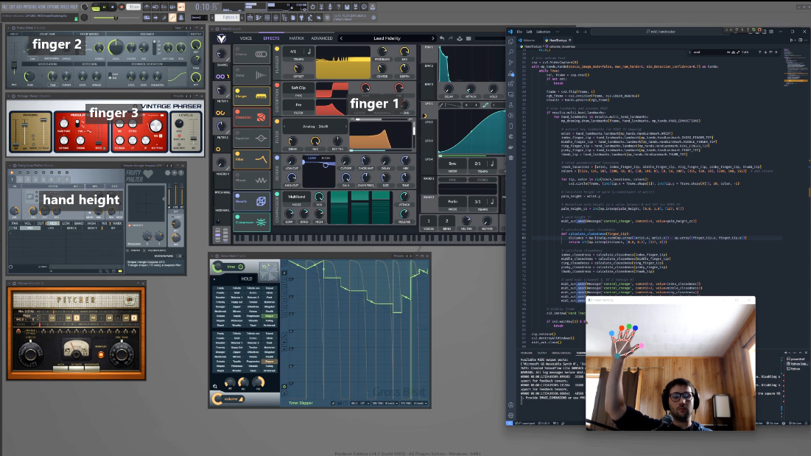
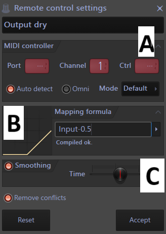

# Hand Track to MIDI CC

This script uses live footage from a webcam to track the user's hand and converts the solved node positions into MIDI control signals (MIDI CC) for the purposes of creating and influencing audio effects.

It's made in Python and uses OpenCV for hand tracking through Google's `mediapipe` library.  The `mido` library is used for MIDI signal generation.  Connect to your preferred audio software using a virtual MIDI cable (e.g., LoopMIDI).

### **Figure 1:** Example Use (see the full [demonstration video](https://youtu.be/Xb88uwkwUaE))



Note that, while I use a paid version of FL Studio, it is the only software that appears in the video which is not free.  And even then, the free version of FL Studio is (to the best of my knowledge) useable with this script.  Either way,  Vital was the primary sound source and is available to use with the creation of a free account.

## Requirements

- [Python 3.12](https://www.python.org/downloads/release/python-3120/)

- [loopMIDI](https://www.tobias-erichsen.de/software/loopmidi.html) virtual MIDI cable by Tobias Erichsen

- MIDI capable software (FL Studio, [Vital](https://vital.audio/), etc.)

## How to Use

1) be sure a camera is attached to the computer (no manual assignment was necessary for me)

2) download loopMIDI and create a virtual port (I named mine "PythonMIDI")

3) open the script with a text editor and add the name of the port from step 2 to the code as seen here:

   `midi_out = mido.open_output('PythonMIDI')`

4) run the script (e.g., through a terminal like powershell by changing the active directory to the folder with the script and executing the text `python hand_track_to_midi.py`) and, after a few seconds, the video feed window should open automatically

5) put a hand into frame and confirm the tracking overlay appears (see images above)

6) find and enable the MIDI port you created from your audio software of choice (FL Studio was used in the video)

7) connect the MIDI CC from the script (channel 1, CC 1-6) to your desired parameters (e.g., filter cutoff, wet/dry mix, etc.)

8) press 'q' to quit the program (exiting the window will not stop the script)

## Tips and Pitfalls

The system is free and relatively easy to create and use, but here are a few difficulties that may arise:

- **Python Version Pitfall:** Mediapipe would not even install for me with Python 3.13 (current version as of writing).  I recommend a virtual environment with 3.12 if your installation fails

- **LoopMIDI Port Naming Bug:** You will have to name your port in loopMIDI and use that same name in the code.  HOWEVER, for me, the port was created slightly different from how I typed it ("PythonMIDI 3" instead of "PythonMIDI").  I included a print statement to show the available ports, so be sure to check the terminal if the script fails before video capture initiates

- **Linking Tip:** I found it easiest use the `Multilink to Controllers` button (hotkey `ctrl + j`) in FL studio and tweaking a parameter's dial/fader while my hand was on-screen to initiate the link.  FL will detect the port and channel for the active input, and so only the CC number at the top of the 'Remote control settings' pop-up (Figure 2A, "Ctrl") will need adjusted to the desired finger based on the script.  Default control values are as follows:

```
(1) wrist - vertical position (raised hand = higher value)
(2) index - flexion (flexed finger = higher value)
(3) middle - flexion (same)
(4) ring - flexion (same)
(5) pinky - flexion (same)
(6) thumb - flexion (same)
```

### **Figure 2:** Remote Control Settings



- **Mapping Tip:** the CC value maps can be tailored to the desired sensitivity and range of the parameter you are controlling (e.g., maybe a filter sweep sounds desireable only across a small fraction of the possible CC values and so the small range of motion of a finger's bend would present a frustratingly narrow range of desireable change).  The mapping can be altered in the script relatively easily, but I found that FL's `Mapping formula` field (Figure 2B) allowed for an intuitive and responsive testing ground for appropriate CC values on each parameter.  There are many presets with example operations available in the drop-down, but I often used something simple like `Input - 0.5`, leveraging the automatic function clamping as represented by the adjacent plot (which updates when you press `enter`).  This `Input - 0.5` example would be useful if, for instance, I wanted the parameter to remain unactivated (at 0) unless the finger was very flexed and I also didn't want the parameter to ever reach beyond half of its range.

- **Smoothing Tip:** I found unsmoothed data to be acceptable in some contexts, but never preferable.  The script can be modified to include smoothing, but FL has a native smoothing function (Figure 2C) with a customizable time window that I found to be sufficient at around 15 ms (monitor the value in the `hint panel` at the top-left of the FL window while moving the slider).  Even with this additional delay, I felt the latency was noticeable, but far from prohibitive for CC control.

- **Recommended Parameters Tip:** I found slow attack and release parameters ideal for this system, with a mix of generator-specific and global parameters to keep changes fresh.  The 'input' wetness of a global delay or reverb coupled with the pre-amp drive and low-pass cutoff of a generator allowed for some satisfying momentary accenting/shaping.  An LFO-paired global lowpass (e.g., Fruity Love Filter's 'triangle low-pass' preset) mapped to the breadth of the wrist's vertical range made for some satisfying 'fade-in,' 'fade-out' swell, like a dramatic orchestra conductor, and stereo effects from the phaser settings allowed its wetness parameter to function similarly as a global ambience control.  Countering with pre-amp drive on the finger flexion allowed the synth to cut through.  I had high hopes, but low success, with pitch bending, but the addition of some quantize + note glide control could be effective.

## Future Directions

I don't anticipate building on this much.  It's basically mediapipe and mido working as they were intended out of the box... not terribly creative on my part.  There are some potential improvements that have occurred to me, though

One space with ample room for improvement is the way gestures are recognized. "Finger closedness" is calculated based on fingertip-to-wrist distance which is both (1) vulnerable to the hand's forward angle with the camera and (2) requires mapping to bridge the remaining gap for even a fully folded finger.  A different node association could be used, but that would still not be robust to angling (though perhaps the wrist angle could be feel natural as another dimension of control)

Recognizable gestures (e.g., peace, rock on) and speed-based control (e.g., wrist flick) are also within reason.  Though I couldn't be bothered to investigate, I imagine mediapipe or another library has a gesture recognition model that could be employed rather than working from scratch.  Similarly, if a whole-body model is as robust as the hand model, I imagine that could present some interesting (if exhausting) possibilities

The MIDI signals can also be sent from the computer to trigger lighting on a MIDI controller with LED pads (e.g., Novation Launchkey 49).  This could easily extend to a proper DMX-controlled lighting system with a DMX-to-MIDI interface.

Finally, the MIDI output could be expanded to send additonal, like note-on/off messages.  Certainly any percussive or otherwise transient-heavy triggered audio would suffer from the latency of this method, but I can imagine perhaps a slow-attack pad feeling satisfying.  Alternatively, a simple trigger can be made to trigger a more complex orchestration of sounds and effects using FL's `Patcher` and `Key Mapper` plugins to generate multi-instrument chords, arpeggios, bass, etc. (as demonstrated [here](https://youtu.be/1eidT2TAIt8) for my FRK AutoChords Patcher preset).  Though not shown in the video, I can imagine using FL's quantization to force the imprecise timing on the the grid for a more polished sound for recording or live performance.  Speaking of which, FL's native 'Performance Mode' fit the bill nicely, perhaps using the CC values in 'latch trigger' mode, switching binary state beyond a certain threshold with some kind of 'de-bounce' logic.
